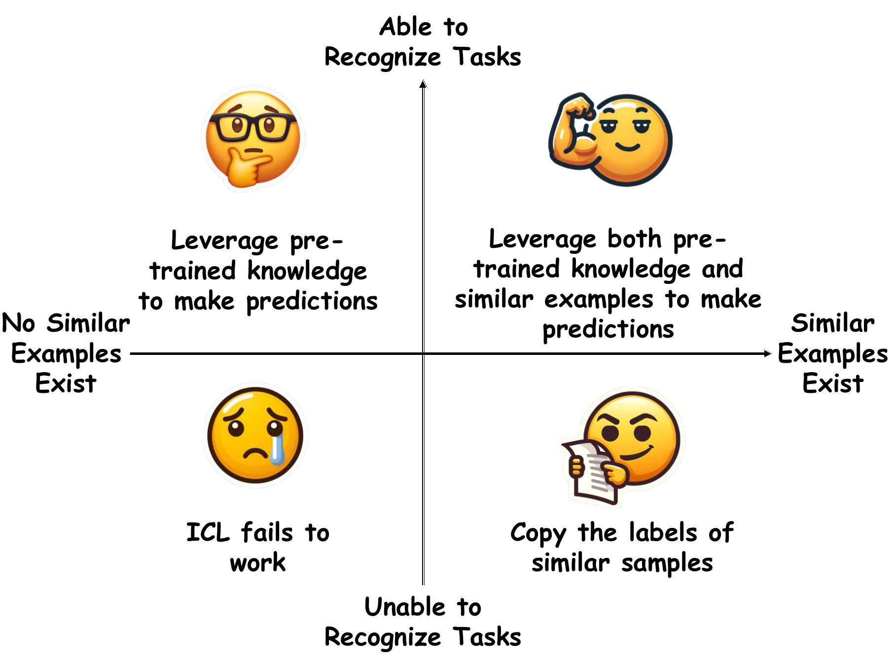

<div align="center">

# Unveiling In-Context Learning: A Coordinate System to Understand Its Working Mechanism


📰 [Paper](https://www.arxiv.org/abs/2407.17011)

</div>

## 1. Introduction
Large language models (LLMs) exhibit remarkable in-context learning (ICL) capabilities. However, the underlying working mechanism of ICL remains poorly understood. Recent research presents two conflicting views on ICL: One attributes it to LLMs' inherent ability of task recognition, deeming label correctness and shot numbers of demonstrations as not crucial; the other emphasizes the impact of similar examples in the demonstrations, stressing the need for label correctness and more shots. 

<p align="center">
  
  <p align="center">An overview of the proposed two-dimensional coordinate system for ICL.</p>
</p>

In this work, we provide a **Two-Dimensional Coordinate System** that unifies both views into a systematic framework. The framework explains the behavior of ICL through two orthogonal variables: *whether LLMs can recognize the task* and *whether similar examples are presented in the demonstrations*. We propose the peak inverse rank metric to detect the task recognition ability of LLMs and study LLMs' reactions to different definitions of similarity. Based on these, we conduct extensive experiments to elucidate how ICL functions across each quadrant on multiple representative classification tasks. Finally, we extend our analyses to generation tasks, showing that our coordinate system can also be used to interpret ICL for generation tasks effectively.

## 2. The Coordinate Axes
### x-axis: Example Similarity
We find that although ICL tends to slightly favor semantically similar examples over lexically similar ones, the preference for both is significantly greater than randomly selected examples. Thus, **regardless** of whether the similarity is lexical or semantic, as long as demonstrations contain examples of either type, we consider them to contain similar examples.

### y-axis: Task Recognition
Inspired by the recent work [*Label Words are Anchors*](https://arxiv.org/abs/2305.14160), which demonstrates that label words serve as semantic anchors, we propose a new metric called **PIR** to quantify a model's ability to recognize tasks.

For a given layer `l` corresponding to a label token, we project the hidden state <code>h<sub>l</sub></code> into the vocabulary space by multiplying it with the pre-trained language model head <code>E</code>. The rank of the task-representative token within this projected distribution is denoted as <code>rank<sub>task</sub>(h<sub>l</sub>, E)</code>.

The **PIR** is formally defined as:

```math
PIR = \max_{l} \frac{1}{rank_{task}(h_{l},E)}
```

## 3. Experimental Settings
### Datasets in Which Models Can Recognize Tasks

These datasets are used for the upper part of the x-axis. We employ the Stanford Sentiment Treebank Binary ([**SST-2**](https://aclanthology.org/D13-1170/)) for sentiment analysis. In addition, we create two datasets for the **World Capitals** and **Reasoning about Colored Objects** tasks, which contain 50 hand-crafted pairs of _country-capital_ and _object-color_, respectively. 

### Datasets in Which Models Cannot Recognize Tasks

These datasets are used for the lower part of the x-axis. We utilize the Text REtrieval Conference ([**TREC**](https://aclanthology.org/C02-1150.pdf)) Question Classification dataset for question type classification and the EmoContext ([**emo**](https://aclanthology.org/S19-2005.pdf)) for emotion classification.

### Models

We adopt a comprehensive suite of models, including [**GPT2-XL**](https://cdn.openai.com/better-language-models/language_models_are_unsupervised_multitask_learners.pdf) (1.61B) and [**GPT-J**](https://github.com/kingoflolz/mesh-transformer-jax) (6B) from the **GPT series**; **Llama-2-7B**, **Llama-2-13B**, and their instruction-tuned counterparts from the [**Llama series**](https://research.facebook.com/publications/llama-open-and-efficient-foundation-language-models/); and **Falcon-40B**, along with its instruction-tuned variant from the [**Falcon series**](https://falconllm.tii.ae/).

## 4. The Working Mechanisms of ICL Across Different Quadrants
### First Quadrant
In the first quadrant, models can leverage their pre-trained knowledge to make predictions once they recognize the task and can also refer to the labels from similar examples if their pre-trained knowledge is insufficient. However, if the labels of similar examples are incorrect, **smaller models tend to replicate these incorrect labels, while larger models tend to rely on their pre-trained knowledge for making predictions.**

### Second Quadrant
In the second quadrant, models primarily leverage their pre-trained knowledge to make predictions. Moreover, given that each input-label pair plays an identical role in helping models recognize tasks, **increasing the number of in-context examples does not significantly enhance the effectiveness of ICL.**

### Third Quadrant
In the third quadrant, **ICL fails to work.** Specifically, models fail to leverage the ICL content for making predictions and tend to predict the label of the first example.

### Fourth Quadrant
In the fourth quadrant, models directly **replicate** the labels of similar examples. Therefore, the performance of ICL depends heavily on whether the labels of similar examples match the ground truth labels of test samples. Additionally, **larger models are better at recognizing similar examples**, which increases their tendency to copy the labels from these examples.

## 5. Usage
### Installation
We have used `Python 3.9.18` with the following dependencies.
```shell
pip install -r requirements.txt
```
### PIR
One can use **PIR** to quantify a model's ability to recognize tasks.
```shell
python task_recognition_pir.py \
  --model_name={Name of the model to load} \
  --label_index={Index of the label token} \
  --plot_file={Name of the plot file}
```

### First Quadrant
Through experiments with models of varying sizes, one can observe that in the setting where Similar(T) has an incorrect label, smaller models tend to replicate these incorrect labels, while larger models are more inclined to leverage their pre-trained knowledge when making predictions.
```shell
python first_quadrant.py \
  --model_name={Name of the model to load} \
  --dataset_path={Path to the dataset directory} \
  --num_samples={Number of test samples for experimentation}
```

### Second Quadrant
One can observe that increasing the number of in-context examples does not lead to significant changes in the performance of ICL.
```shell
python second_quadrant.py \
  --model_name={Name of the model to load} \
  --dataset_path={Path to the dataset directory} \
  --shot_number={The number of in-context examples}
  --num_samples={Number of test samples for experimentation}
```

### Third Quadrant
ICL fails to work.
```shell
python third_quadrant.py \
  --model_name={Name of the model to load} \
  --dataset_path={Path to the dataset directory} \
  --num_samples={Number of test samples for experimentation}
```

### Fourth Quadrant
One can observe that by increasing the model size, larger models demonstrate superior capabilities in recognizing similar examples.
```shell
python fourth_quadrant.py \
  --model_name={Name of the model to load} \
  --dataset_path={Path to the dataset directory} \
  --num_samples={Number of test samples for experimentation}
```

## 6. Citation
```bibtex
@inproceedings{zhao2024coordinate,
  title={Unveiling In-Context Learning: A Coordinate System to Understand Its Working Mechanism},
  author={Anhao Zhao, Fanghua Ye, Jinlan Fu, Xiaoyu Shen },
  booktitle={Proceedings of the 2024 Conference on Empirical Methods in Natural Language Processing (EMNLP)},
  year={2024},
}
```

## 7. Contact
If you have any questions, feel free to raise an issue or contact us at <zhaoanh@my.swjtu.edu.cn>.